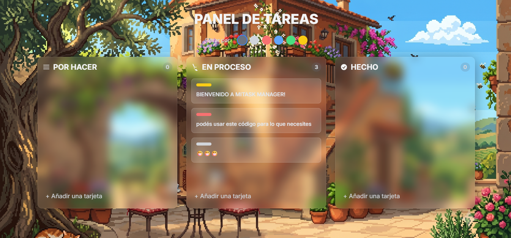

# 📋 Panel de Tareas (Task Manager App)



Una aplicación interactiva y elegante para la gestión visual de tareas (Tablero Kanban) construida con **Vue 3** y estilizada mediante **Tailwind CSS**. Este proyecto implementa una estética de diseño moderna basada en **Glassmorphic UI**, ofreciendo interfaces translúcidas con desenfoque de fondo y efectos visuales fluidos.

---

## ✨ Características Principales

* **Diseño Glassmorphism Moderno:** Una interfaz de usuario vibrante con columnas y tarjetas translúcidas, desenfoques dinámicos (`backdrop-filter`) y transiciones sumamente fluidas.
* **Gestión Kanban Interactiva:** Organiza tus actividades a través de tres estados predeterminados: *POR HACER*, *EN PROCESO* y *HECHO*.
* **Sistema de Arrastrar y Soltar (Drag and Drop):** Mueve tarjetas entre columnas con total libertad o reordénalas de manera intuitiva dentro de la misma sección.
* **Clasificación por Etiquetas de Colores:** Asigna prioridades o categorías a tus tareas mediante un selector de etiquetas de color (Gris, Rojo, Azul, Verde, Amarillo).
* **Filtros Dinámicos:** Selector en la cabecera para filtrar el tablero de forma instantánea y visualizar únicamente las tareas con un color de etiqueta específico.
* **Edición Directa In-situ:** Modifica el texto de cualquier tarea haciendo doble clic sobre la tarjeta. Cuenta con auto-enfoque e intuitivo guardado al perder el foco (`blur`) o pulsar `Enter`.
* **Persistencia Local (LocalStorage):** No pierdas tus datos al recargar la página. El estado del tablero se sincroniza automáticamente en el almacenamiento local del navegador.
* **Confirmaciones Seguras:** Modal integrado para evitar la eliminación accidental de tarjetas mediante flujos de confirmación estilizados.

---

## 🛠️ Tecnologías Utilizadas

* **Vue 3 (CDN):** Gestión del estado reactivo, directivas personalizadas (`v-focus`), transiciones integradas (`<transition-group>`) y propiedades computadas para el filtrado eficiente de datos.
* **Tailwind CSS:** Framework de estilos utilitarios que proporciona un diseño completamente adaptable (*responsive*) tanto para dispositivos móviles como de escritorio.
* **CSS3 Custom Properties:** Estructura modular de variables para definir fondos y esquemas de color Glassmorphic de manera centralizada.

---

## 🚀 Instalación y Uso Local
Al ser una aplicación basada puramente en el cliente (Frontend-only), no requiere de servidores ni de procesos de compilación complejos.

1. Clona este repositorio en tu máquina local:
   git clone [https://github.com/tu-usuario/task-manager-app.git](https://github.com/tu-usuario/task-manager-app.git)
2. Navega al directorio del proyecto:
   cd task-manager-app
3. Abre el archivo task-manager.html directamente en tu navegador web preferido.

---

## 📂 Estructura del Proyecto

```bash
├── task-manager.html   # Estructura semántica, plantillas de Vue y layouts de Tailwind.
├── app.js              # Lógica de Vue 3, configuración de columnas, directivas y estado.
├── style.css           # Personalización y variables del diseño Glassmorphic y animaciones.
└── README.md           # Documentación del repositorio.
